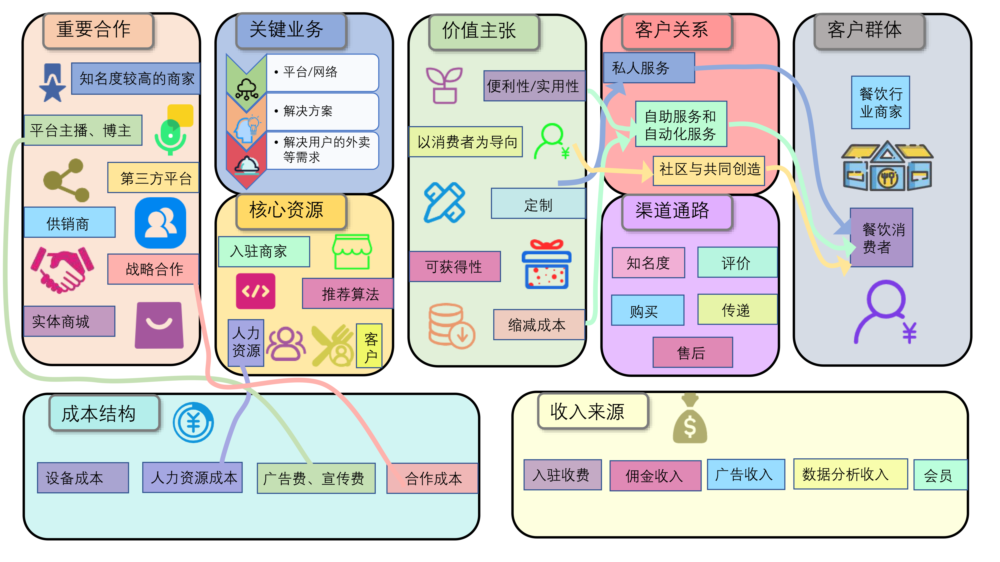

## 3.1 资源驱动

### 问题：如果向其他企业提供硬件租赁服务会怎么样？

**回答**：一定程度上可以使多余的硬件资源得到充分利用。但是可能面临硬件损坏、维修、更新等问题，需要投入更多的人力和物力成本。另外，可能遭遇用户随时终止或者只用一段时间的情况，导致收入不稳定，还需要与其他硬件租赁服务商竞争。

## 3.2 供给驱动

### 问题：如果允许商家进行广告竞价会怎么样？

**回答**：一定程度上可以增加收入来源，但是不利于营造良好的商家竞争环境，容易造成恶性竞争。此外，数据的真实性可能会受到一定影响，因此，不利于提升用户体验，会影响用户的搜索体验，降低用户的搜索效率和便利性。

## 3.3 客户驱动

### 问题1：如果提供外卖服务会怎么样？

**回答**：如果提供外卖服务，客户群体会有所增加，也可以吸引更多的人来使用我们的app,但是需要与现有的外卖行业中的企业进行竞争，因此风险很高，而且成本投入也非常高，主要体现在人力资源成本上，也会有一定开发成本。

### 问题2：如果向用户提供除美食之外的推送会怎么样？

**回答**
：如果提供如景点、演唱会等其他的推送，可以使app的内容更加丰富，也可以使用户的娱乐生活更加便利，但是需要app有很高的流量，由于推送景点之类的app有抖音、携程、小红书等，演唱会有大麦等，因此想要把人们的娱乐生活的问题解决完全集成在一个平台上，还有较大的困难。

# 第4部分 视觉化设计

> 商业模式画布

## 4.1 客户细分

1. 店铺商家
    1)
    对于希望提高客流量的商家，本产品提供各门店入驻的空间，便于商家提供自身信息来扩大宣传，同时增加活动，优惠等服务，便于吸引顾客从而增加客流量。同时商家也可以了解用户的行为习惯，口味偏好等，并且根据这些信息调整销售策略来提高客流量。
    2) 对于希望提高知名度的商家，本产品拥有多层次的客户交流平台，提供优质服务的商家更容易获得优势，在平台上可以广泛传播。
    3) 对于需要更加真实的客户评价，从而改进自身产品的商家，多层次，不同范围的用户交流平台可以更加真实地反映顾客的喜好，以及对商家的评价，同时商家也可以参与讨论，来提升自己的服务质量。
2. 消费者
    1. 对于希望通过更加简易的方式准确寻找周边餐馆的用户，本平台可以通过关键词搜索的方式将附近符合要求的商家进行推送，同时良好的用户交流平台供用户一个更加详细而真实的参考。
    2. 对于急需用餐，或者节约排队时间的用户，本产品会通过用户和商家等多重渠道收集和提供部分门店的排队人数，以及用餐高峰的预测。
    3. 对于美食爱好者以及乐于进行交流评价的用户，本产品拥有从街道到门店等多层次的社区交流平台，供用户进行交流和分享。
    4. 对于希望节省费用的客户，本产品会定期提供一些优惠折扣等服务，让用户享受更低的价格。

## 4.2 价值主张

1.
便利性/实用性：本产品为消费者提供美食街或购物中心餐饮层的向导服务，主要包括各个店铺的位置以及拥挤情况和排队人数，饮食种类及客户评价，帮助消费者找到迅速自己心仪的美食店并且不因排队浪费太多时间。同时，本产品也提供一个社群交流平台，消费者可以在平台上查询对某家店铺的评价，也可以在到店之前就预先点餐，体验之后还可以发布评论或者直接对店家提出建议。
2.
以消费者为导向：本产品将各店铺的各项信息客观地完全展现在消费者面前，使得他们可以根据自己的喜好选择心仪的店铺用餐。本产品在平台上实时更新的美食店的用餐人数，排队情况等信息，用户也可以预先点餐，确保消费者可以即进即坐，即坐即享用美食。为确保公平性，不蒙蔽消费者，本产品将完全根据消费者需要的信息来对美食店进行排序，而不是依靠广告费的多少。本产品同时将把平台的一部分打造成一个小型贴吧。用户可以在美食推荐、店铺评价等方面展开活跃的讨论。
3. 定制：本产品结合全范围内的各家美食店信息，综合各种数据，为消费者提供具有针对性的店铺推荐。对于商家，也可以了解整个美食街或餐饮层的种类分布，便于及时更改美食种类和风格。同时也可以招徕更多新的商家来加盟。
4. 可获得性：可以利用实时的店铺信息来决定到哪里就餐，避免拥挤或者长时间排队。商家也可以利用本产品统计许多经营信息，比如销量最高的菜肴，一天中用餐的客人最多的时间段，本店在同种类型的美食店的受欢迎程度排名等。
5.
缩减成本：本产品整合全范围的所有餐饮店，用户可以寻找离自己附近的店铺，查看美食信息，线上订单，在用户交流平台上查询，这些都可以帮助消费者节约时间成本。本产品可以将旗下的美食街或美食层作为一个整体来对外宣传，便于增强宣传效应和影响力，还可以减少宣传成本。本产品可以把大部分的食材和原料的购买与批发市场直接对接，可以减少运输成本，由于体量大，购买价格也会有一定下降。

## 4.3 关键业务

1. 平台/网络:
   本产品通过发帖回复式交流，可以提供用户一个讨论平台，以及给予用户某个餐馆更真实可靠的评价，让用户得到更可靠的参考。同时可以精选出部分帖子，来使用户的查找更加快捷。通过区域式的搜索也可以帮助用户精准定位自身希望去的门店的范围，帮助用户快速查询。
2.
解决方案：对于用户来说，在闹市区域或者热门门店，网红打卡地点等排队人数往往较多，等候会浪费掉一部分时间，或者对于急需用餐的顾客造成不便。本产品为此类用户提供排队人数，用餐高峰期的参考，让用户更加迅速便捷地挑选自己想去的时间和门店。为更加需要用户的真实评价，提高自身知名度的商家一个参考，来进行自身的改良。
3. 解决用户的外卖等需求：本产品致力于解决用户的餐饮问题，尽量打造一个商家能公平竞争，用户可以得到完全真实信息的平台，以满足用户的餐饮需求，使用户能找到自己心怡的餐厅，也能点到合适的外卖，而不被无关的广告烦心。

## 4.4 成本结构

1. 设备成本：服务器与其他硬件的购买与维护。
2. 人力资源成本：开发人员、营销人员等的工资奖金等。
3. 广告费、宣传费：包括与知名主播、博主合作产生的费用。
4. 合作成本：与短视频平台、搜索引擎等第 三方平台合作产生的费用。

## 4.5 收入来源

1. 入驻收费：商家入驻需要收取一定费用。
2. 该软件为商家提供了一个与顾客交流的多边平台，商家在此平台上的获利需要缴纳一定的费用用于平台运营与维护。
3. 广告收入：在APP进入界面可以提供首页广告，用户可以自主跳过；在用户浏览美食推荐时，APP会为推广商家展示广告界面，推广商家需要缴纳一定的广告费用。
4. 数据分析收费：软件提供数据分析功能，使用此功能的商家需要缴纳一定的使用费用，包括客流量随时间变化的信息，食客喜好分析、用户评价分析、菜品受欢迎程度分析等。
5. 会员收入：消费者可以购买会员获取美食折扣，还可参加会员日活动等。

## 5.3 画布中各模块的联系

### 9. 客户细分=>渠道通路

对于不同的客户，我们需要建立不同的分销渠道。例如，在产品发售初期，我们会通过各大不同的网络平台进行宣传，并获得不同的客户群体，例如在b站、小红书等年轻人较多的平台上进行宣传所获得的用户群体就以学生为主，他们就会更加注意餐厅的价格和时间之类的因素。

### 10.客户细分=>价值主张

价值主张是为某一客户群体提供能为其创造价值的产品和服务，一个价值主张通过针对某个群体的需求定制一套新的元素组合来为该群体创造价值。例如，我们的价值主张中的便利性和实用性几乎适用于所有客户，但是定制就更偏向于注重口味和体验的用户，缩减成本则更倾向于看重价格的用户。

### 11.价值主张=>关键业务

关键业务是一个企业成功运营所必须采取的最重要的行动，是企业为创造和提供价值主张、获得市场、维系客户关系以及获得收益所必须的。我们的价值主张中有以消费者为导向，因此我们尽量提供消费者最需要的解决方案，即保证信息的真实，严禁刷榜，使消费者拥有最好的搜索体验。

### 12.价值主张、关键业务=>收入来源

收入来源这一模块代表了企业从每一个客户群体获得的现金收益。通过平台、网络为商家创造一个能宣传竞争的环境，同时商家需要定时教你一定的佣金，这构成了收入来源的一个重要组成部分。在价值主张中我们以消费者为导向同时提供定制服务，若用户需要享受更加优质的服务，可以充值会员，这也构成了收入来源的一个组成部分。

### 13.客户细分=>收入来源

客户是任何一个商业模式的核心，没有（能带来利润的）客户，没有哪家公司能一直活下去。我们的核心收入来源是入驻商家，而商家的收入来源是各类消费者，因此，平台需要有尽可能多的客户群体，从而吸引各类不同的商家，从而扩大收入来源。

### 14.价值主张、关键业务=>核心资源

核心资源是保证一个商业模式顺利运行所需的最重要资产，每一种商业模式都需要一些核心资源，这些资源使得企业得以创造并提供价值主张，获得市场，保持与某个客户群体的客户关系并获得收益。便利性、实用性是我们价值主张中的一个重要部分，我们通过提升算法等个性化服务，增强用户的便利性和软件的实用性，因此，推荐算法是我们核心资源的重要部分，同时开发人员也是一项重要的核心资源。

### 15.客户关系=>关键业务

由于我们共同创造和社区的客户关系，所以创造一个方便消费者与消费者交流的社区网络平台是我们的关键业务之一。此外我们还希望消费者与商家也能进行良好地交流，进行真实地评价，避免出现刷榜、网络暴力等不利现象。我们希望我们的根据业务是通过网络/平台建立一个能良性互通的社区。

## 5.4 基本事实

1. [数字化潮流下的餐饮行业](https://zhuanlan.zhihu.com/p/461857656)  
   在疫情期间，餐饮业经历阵痛的同时，线上化能力、零售化能力、私域流量、极致效率突然被快速落地。餐饮行业的数据掘金，是从餐饮服务到数据挖掘的蜕变过程，是对餐饮企业经营的重大革新。未来一家餐饮企业如果只有堂食，那必然无法和竞争对手抗衡。
2. [餐饮行业发展前景及趋势分析](https://zhuanlan.zhihu.com/p/430722943)  
   在餐饮消费者人群中，年轻一代已成为新的主力消费群体。银发一族在餐饮中的需求将呈现上升趋势。消费者对于“健康饮食”的注意力不断提升。随着零售电商平台不断趋于成熟，餐饮服务平台不断壮大，外卖占全国餐饮收入比重稳步增长。
3. [餐饮外卖行业研究报告：深耕用户及商户价值，持续稳健增长](https://www.163.com/dy/article/GQQGM3H3053881WI.html)  
   餐饮行业连锁化率低，未来提升空间大。餐饮外卖成为日常刚需，渗透率快速提升。城镇化+互联网普及，带来庞大的用户基础。消费升级，餐饮支出增长，夜间经济等消费场景扩张。年轻一代消费者的懒人经济崛起，单身潮盛行、家庭小型
   化趋势明显。
4. [2021餐饮行业研究报告](https://zhuanlan.zhihu.com/p/405347742)  
   餐饮业是我国较早开放的行业,国际知名餐饮企业的不断涌进。餐饮业作为我国第三产业中一个传统服务性行业，全国已有餐饮网点400万个。餐饮供应渠道多元，餐饮企业采用多供应商模式，70%餐饮企业供应商数量在100个以上。
5. [2022年中国餐饮行业发展现状及市场调研分析报告](https://www.iimedia.cn/c400/84947.html)  
   中国餐饮消费者单次消费金额集中在51-100元，其比例为38.7%；其次是101-150元，比例为29.8%。中国餐饮消费者每周外卖消费频次主要集中在5-8次和9-12次，占比分别为37.2%和25.1%。冷链物流技术和设备逐渐完善，保证了餐饮食材在运输、仓储环节的品质。