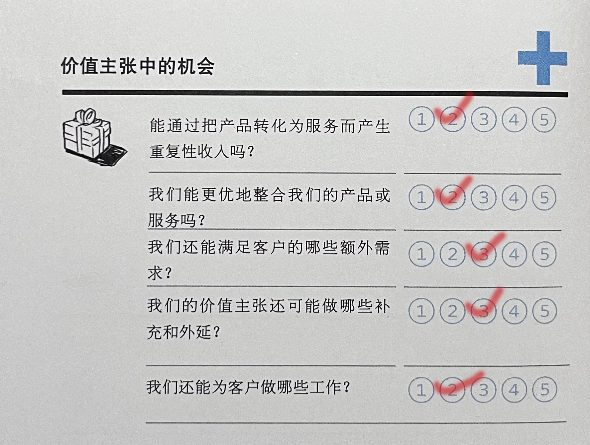

## 2.1.3 市场问题
### 问题1：影响客户环境的关键问题有哪些？
**回答**：中国的Z时代正在成为消费主力，而现在00后也逐渐成年，也正在成为新的消费主力。相比与70或80后，年轻人更注重新奇的消费体验，他们更加善于使用互联网，每天从各种各样的渠道获取信息，不受限于单一的渠道。另外，随着生活条件的不断改善，人们对饮食健康地关注也在不断加强。  
引用：[餐饮行业发展前景及趋势分析](https://zhuanlan.zhihu.com/p/430722943)  
### 问题 2：哪些改变正在发生？
**回答**:
1. 直播带货是餐饮企业的新渠道，要借助网红、KOL等影响力人物推广品牌和产品；  
2. 社区团购和智能化设备是餐饮企业的新机遇，要适应消费者的新习惯和新需求。  
3. 私域流量是餐饮企业的重要资产，要通过社交媒体、会员制度、内容营销等方式建立用户粘性和忠诚度。  
引用：[后疫情时代，餐饮业有哪些新趋势？](https://new.qq.com/rain/a/20220524A088N100)
### 问题 3：市场将走向何处？
**回答**:随着中国的经济增长，2022年有超过30%的消费者的消费频次增加，Z时代的消费也逐渐增加，餐饮行业逐渐细分化定制化，选择外卖的消费者逐渐增长。另外，随着冷链技术的逐渐完善，消费者对高品质食品的需求也逐渐得到满足。  
引用：[2022年中国餐饮行业发展现状及市场调研分析](http://www.21jingji.com/article/20220420/herald/db33914662d539e663208c76fc14c653.html)
## 2.2.1 供应商和价值链上的其他厂商
### 问题 1：谁是你的行业价值链中的关键玩家？
**回答**：入驻商家。
### 问题 2：你的商业模式在多大程度上依赖其他这些玩家？
**回答**：我们对于入驻商家的依赖相当大，我们的收入来源主要是商家的佣金。另外，商家的质量也在很大程度上决定了消费者的数量，客户数量增加才能使我们的业务不断扩大，我们也需要能够保持稳定的客户数量以维持稳定的资金流入。
### 问题 3：有边缘玩家在涌现吗？
**回答**：有。例如一些小吃摊贩也可以加入我们平台，但是，可能以这些边缘玩家的竞争力难以匹敌那些高档饭店，美食城。但这些烧烤摊、小饭店也可以联合起来，形成一条独特的小吃街，吸引那些消费能力较低的消费者，从而提高竞争力。
### 问题 4：哪个的利润最高？
**回答**：一般情况下，美食城中好评最多那一家高档餐厅利润最高，美食城本身可以形成一个内部竞争很激烈的平台，当一家饭店最终成功成为并能保持好评率最高后，可以获得最高的客流量并且保持稳定的收入，甚至可以依靠网红效应获得更高的利润。
## 2.2.4 新进入者（挑战者）
### 问题 1：谁是你所处市场的新进入者？
**回答**：如无人餐厅、智能配送、云厨房等。
### 问题 2：他们之间有什么不同？
**回答**：无人餐厅采用自助打餐，智能称重，自助结算的方式，极大地节约了人力资源成本。智能配送是一种通过人工智能和物联网技术实现的配送技术，通过无人机、无人车将外卖送给客户。云厨房通过在城中集中建立多个厨房从而达到节约租金成本的目的。
### 问题 3：他们有什么竞争优势或劣势？
**回答**：无人餐厅可以增强科技感增加趣味性，但是缺乏人情味和定制化服务；智能配送可以减少配送时间，但是容易受法律法规，道路条件，天气状况的影响；云厨房可以降低食材浪费和成本，但是需要占用较大的空间和资源。  
引用：[2020无人餐厅发展趋势报告](https://zhuanlan.zhihu.com/p/127150243)
### 问题 4：他们必须克服哪些障碍？
**回答**：
1. 技术和成本维护，很多设备的成本可能比人力成本更高；
2. 顾客接受度和体验度，有的顾客可能难以接受这些新的操作方式；
3. 法律法规和社会责任，需要遵守食品安全法、消费者权益保护法等。  
引用：[解析无人智能餐厅与传统餐厅的区别](https://zhuanlan.zhihu.com/p/376054468)
### 问题 5：他们的价值主张是什么？
**回答**：无人餐厅可以降低人力成本，准确快速地点餐配菜。智能配送可以可以接受配送员工的工资，同时减少因交通拥堵、事故等造成的时间浪费。云厨房可以通过节省店面租金来降低成本，也可以通过共享设备、原料来降低成本。
### 问题 6：他们聚焦哪些客户群体？
**回答**：追求效率和便利的消费者：如忙碌的白领学生等，他们不太在意餐厅的氛围和服务；喜欢尝试新鲜事务的消费者：这类消费者对科技创新有较强的好奇心和接受度，愿意体验不同于传统餐厅的新型餐饮模式。
### 问题 7：他们的成本结构是什么样的？
**回答**：需要大量的自动化设备和大量IT技术的支持。
### 问题 8：他们对我们的客户群体、收益来源和利润程度有多大的影响？
**回答**：会在一定程度上吸走一部分如学生、白领之类的顾客，但在总体上的影响不会很大；会对我们的小吃快餐之类的便利性较强的店的收益产生一定的冲击；他们只会对较发达地区的利润有不会太显著的影响。
## 2.3.2 行业管理趋势
### 问题 1：哪些管理趋势会影响你的市场？
**回答**：在光盘行动的推动下，我们的商家会推出一些半份菜、小份菜的新品，对一些高级的、高消费的餐厅的市场会有一定的冲击，但是对一些快餐类的、小吃类、的、烧烤撸串类的市场可能反而产生一些新的机遇。  
引用：[北京发布“光盘行动”指引 倒逼餐饮产业再升级](https://www.visitbeijing.com.cn/article/47QnGLndLzr)
### 问题 2：哪些规则会影响你的商业模式？
**回答**：政府的法律法规，例如食品安全、消费者权益保护、反垄断等；餐饮行业的标准规范，例如食品安全的标准、厨房卫生环境的标准等；我们自己制定的规则，如禁止刷榜，尽量保证评论、评分的真实等。  
引用：[中华人民共和国反不正当竞争法](http://www.gov.cn/banshi/2005-08/31/content_68766.htm)
## 2.4.1 全球市场情况
### 问题 1：经济处于爆发期吗？描述总体市场情绪
**回答**：全球经济持续复苏，但是势头有所减弱。一些发达国家和大宗商品出口国的市场情绪较为乐观，但是一些新兴市场和发展中国家的市场情绪较为悲观。另外，在俄乌战争的持续冲击下，未来前景再次充满了不确定性。  
引用：[《世界经济展望》坎坷的复苏&emsp;2023年4月](https://www.imf.org/zh/Publications/WEO/Issues/2023/04/11/world-economic-outlook-april-2023)
### 问题 2：GDP增长率是多少？失业率有多高
**回答**：2022年比上年增长3%，失业率大概在5%左右。相较于2021年，全国餐饮收入将近20%，正餐业、火锅业稳中向好，茶饮业保持较快增长，烧烤业增长规模明显，快餐业增长较为缓和。另外，餐饮数字化服务在近两年得到快速发展。  
引用：[2022中国经济年报](http://www.gov.cn/zhuanti/2022zgjjnb/index.htm)
## 2.4.4 经济基础设施
### 问题 1：基础设施有多优良？
**回答**：2022年，传统与新型基础设施加速融合，4G与5G用户普及率达到87%左右，智慧设施正在进入千行百业。大数据、云计算、区块链也在传统基础设施领域加快应用，如大数据就可以帮助企业进行精准营销。  
引用：[基础设施整体水平实现跨越式提升——国家发展改革委新闻发布会聚焦重大基础设施建设](http://www.gov.cn/xinwen/2022-09/27/content_5712610.htm)
### 问题 2：我们的软件的个人和企业的税额会有多高？
**回答**：中国的企业所得税税率为25%，个人所得税从3%到45%不等，在世界上，既不是最高的也不是最低的。对于中小微企业，税收会有一定的优惠（15%）。总体上中国的税负相对较低（低于世界平均水平）。  
引用：[税收（占国民生产总值（GDP）比例）](https://data.worldbank.org.cn/indicator/GC.TAX.TOTL.GD.ZS)
# 3.3 SWOT 分析
>商业模式核心：价值主张

美团商业模式画布：

## 3.3.1 S&W（优势劣势）

**打分理由**：
1. 美团最核心的价值主张就是帮助消费者找到最核心的商家，客户的需求是能在美团上快速方便地找到他们想要的商家，美团可以通过大数据分析、精确的推荐算法较好地实现客户的这一需求。
2. 就美团的商家而言，入驻的商家越多种类越丰富，美团的价值就越大，因为这样就越能更广地覆盖人们差异化的需求；但是就美团的用户而言，用户数量的增长虽然可以增加评论和反馈，但是对美团的价值贡献并不是很大。
3. 美团的产品和服务具有很好的协同效应，美团的商家质量越高，客户所感受到的服务就越好，美团APP的服务或使用体验约会，也能在一定程度上促进商家的推广，但是如果商家和APP的反差过于强烈，很可能适得其反。
4. 客户的便利性可以很好地在美团APP上实现。但是，收到推广、广告业务的影响，客户并不能以最快、最直接的方式找到最心怡的商家。而我们的APP则可以很好地改善这一点，力求商家的公平竞争和评论区的真实可靠。
## 3.3.2 O&T（机会威胁）

**打分理由**：
1. 对美团而言，现在几乎不存在完全可替代的产品和服务，饿了么虽然在外卖行业和美团相似，但是竞争力远低于美团，只在不太发达的城市比较活跃，高德地图虽然也能用来找吃喝玩乐的场所，但它的主要功能依然是地图和导航。
2. 目前美团的竞争对手已经很难再报出有竞争力的价格了，因为规模上不可能超越美团，所以在成本上也不可能低于美团，除非有颠覆性的技术出现，不然无法报出更有竞争力的价格。同样，在餐饮、外卖行业目前也没有更好的价值。

**打分理由**：
1. 美团的产品本身就是一种服务，但是现在美团APP的发展已经非常完善，很难再有大的更新，因此，美团可以继续把产品转化为服务，但是成效不会特别显著，美团可以做一些增值服务，但是可能会失败。
2. 美团的产品已经高度整合了，各个模块都很完善，用户体验也较为舒适。因此美团几乎不能再更优地整合他们的产品或服务了，除非有新的产业出现，或者抢别人饭碗，或者对其他的业务进行扩展，但是与美团相似的业务也没有太多了。
3. 美团还可以满足客户在旅游、演出、展览之类购票、攻略能方面的需求。但是，受现有市场占有的影响，美团难以再扩展或占有更多的市场。因此，美团难以再满足客户的额外需求。此外，共享单车和网约车似乎是个比较可行的业务。
4. 营造一个商家的良好的竞争环境、为客户提供更加真实可靠的数据，使客户的选择权能够充分实现。但是，这样会影响广告业务的开展，不利于一些新的商家进行推广，因此，在现有的商家环境下，要再提高客户的选择体验，可能会对商家利益产生过大冲击。
5. 美团还可以研发更加易于沟通的智能客服，这样既可以降低人力资源成本，又可以改善客户的交流体验，还可以节约客户等待客服人员回复的时间。此外，美团还可以完善物流业务，为客户更快速地提供优质的生鲜、食材等。