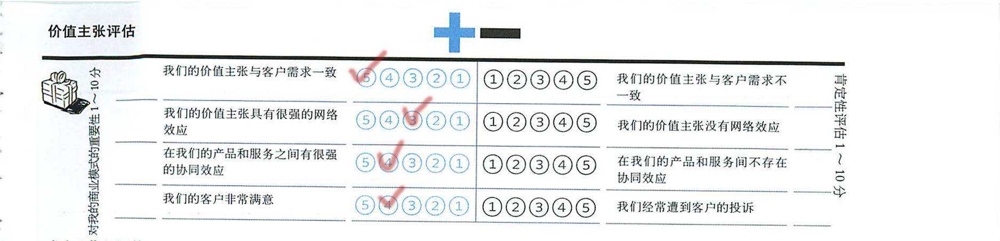
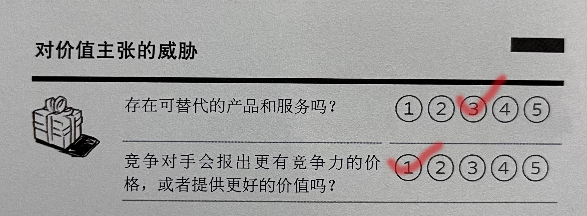
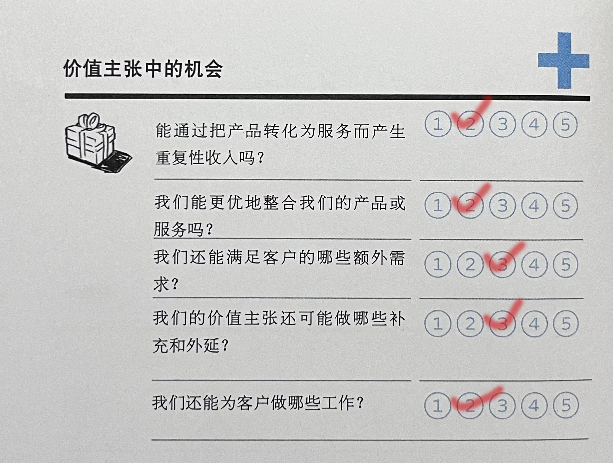

[TOC]
# 一、项目总览

## 1.1 组员信息

| 姓名 | 学号 |
|----|----|
|    |

## 1.2 度量数值

1. 总体评估：加分项 6 项；减分项 4 项；总共 10 项
2. SWOT 分析（包含机会与威胁评估）中的所有评分项都进行了打分和阐述理由；
3. 引用的调研报告和新闻共 25 篇
4. 更新过的商业模式画布中新增或修改过的模板要点占二阶段画布模板要点总数的 23% 左右

## 1.3 文档简介

本次实验，本小组对商业模式环境进行了分析，评估了我们商业模式的核心元素——价值主张，对我们其中一个竞品美团进行了SWOT分析，并选择价值主张进行了蓝海战略的探索，实现了对我们的商业画布的更细致的分析与各项的评估，完成了对于商业画布的更新与完善。

# 二、商业模式环境

## 2.1 市场影响力

### 2.1.1 市场分类

> ***问题 1： 哪些是最重要的客户群体？***
>
> ***回答 1：***
对于餐饮行业商家来说，我们对其的主要提升点是增加客流量以及知名度。**新冠疫情爆发后的近几年，大量餐饮商家转战线上平台，更高的餐饮供应链的效率和数据化的管理使入驻的商家往往在竞争中占有优势。以及公开透明的宣传以及评价可以使希望提高客流量的商家获得更多的机会吸引顾客和改造品牌，使自己的品牌火速“出圈”。**
对于消费者来说，我们会提供更加精准的餐馆筛选服务和公开自由的评价系统，在如今网络信息冗杂，以及快节奏的生活境况下，如何光速筛选出符合自身要求的餐饮商家是很多不知道如何选择消费者所需要的。除了个性化推荐，在刷评论，刷数据乱象频发的情况下，用户更加需要一个真实反映其他用户评论，或者通过评论防止其他用户“踩雷”的平台来获得更舒适的体验，以及对于急需用餐的顾客，本产品可以更加可靠地帮助用户来减少决策时间。这些快节奏消费者往往是我们主要的市场群体。

引用：[数字化潮流下的餐饮行业 - 知乎 (zhihu.com)](https://zhuanlan.zhihu.com/p/461857656)

> ***问题 2： 哪个群体的增长潜力最大？***
>
> ***回答 2：*** 网络餐饮平台服务如今已相当成熟，在美团与饿了么两大餐饮外卖行业巨头的竞争下，消费者群体的增长潜力相对较高。**消费者人口基数大，覆盖率高，年轻一代人已经成为消费者的主力军而且仍在不断扩大，同时城镇化率提高，互联网的普及也为这类平台吸引用户带来庞大的用户基础。**

引用：[餐饮外卖行业研究报告：深耕用户及商户价值，持续稳健增长](https://www.163.com/dy/article/GQQGM3H3053881WI.html)

> ***问题 3： 哪些边缘群体值得留意？***
>
> ***回答 3：*** 一些乐于在网上评论，分享体验的消费者，商家或者博主等，应给予他们一个自由评论的空间，鼓励他们分享经验，筛选优质评论。同时也鼓励举报刷评论，伪造数据等现象。这些用户的评论往往给其余商家或者消费者一个明确的参考，来帮助商家改良自己的品牌，或者帮助用户筛选合适的商家。

### 2.1.2 需求和诉求

> ***问题 1： 客户需要什么？***
>
> ***回答 1：*** 在交易过程中存在美食商家和消费者之间的信息不对称。对于商家来说，他们需要知道消费者的消费习惯、消费者对美食的诉求、消费者的评价信息；对于消费者来说，他们需要知道商家的经营信息、商品的评价信息等。消费者也担心被平台“坑”，被割韭菜。因此，随着人们生活质量的提高，消费者也需要一个尽可能客观、公正的平台，为他们提供一个安全、公平、自由的环境。这是我们平台需要努力去促进和推动的方面。

> ***问题 2： 最能吸引消费者的是哪一点？***
>
> ***回答 2：*** 就目前来看，对于消费者和美食商家来说，解决他们之间的信息交流不畅的问题是最重要的。因为只有打通了商家和消费者之间、消费者和消费者之间的信息沟通渠道，才能使得商家和消费者在消费行为中获得便捷，促进平台的内容更加丰富和互动更加频繁。从而吸引更多消费者甚至更多商家加入平台。

> ***问题 3： 根据当前情况，有什么新的需求？***
>
> ***回答 3：*** 疫情结束不久，经济复苏开始，此时是抢占市场的好时机。本平台可以联合许多商家，形成一个整体，共同发展，因此风险较小，可以使得潜在想要进入餐饮行业的商家不断增加。对于消费能力已经有所降低的消费者，本平台也会为他们提供实惠，促进其消费。

引用：[【大力提升平台消费创造能力 激发市场活力和发展内生动力】-国家发展和改革委员会 (ndrc.gov.cn)](https://www.ndrc.gov.cn/xxgk/jd/jd/202201/t20220119_1312333.html)

### 2.1.3 市场问题

> ***问题 1： 影响客户环境的关键问题有哪些？***
>
> ***回答 1：*** 中国的Z时代正在成为消费主力，而现在00后也逐渐成年，也正在成为新的消费主力。相比与70或80后，年轻人更注重新奇的消费体验，他们更加善于使用互联网，每天从各种各样的渠道获取信息，不受限于单一的渠道。另外，随着生活条件的不断改善，人们对饮食健康地关注也在不断加强。  

引用：[餐饮行业发展前景及趋势分析](https://zhuanlan.zhihu.com/p/430722943)

> ***问题 2： 哪些改变正在发生？***
> 
> ***回答 2：***
>1. 直播带货是餐饮企业的新渠道，要借助网红、KOL等影响力人物推广品牌和产品；
>2. 社区团购和智能化设备是餐饮企业的新机遇，要适应消费者的新习惯和新需求。
>3. 私域流量是餐饮企业的重要资产，要通过社交媒体、会员制度、内容营销等方式建立用户粘性和忠诚度。  

引用：[后疫情时代，餐饮业有哪些新趋势？](https://new.qq.com/rain/a/20220524A088N100)

> ***问题 3： 市场将走向何处？***
>
> ***回答 3：*** 随着中国的经济增长，2022年有超过30%的消费者的消费频次增加，Z时代的消费也逐渐增加，餐饮行业逐渐细分化定制化，选择外卖的消费者逐渐增长。另外，随着冷链技术的逐渐完善，消费者对高品质食品的需求也逐渐得到满足。  

引用：[2022年中国餐饮行业发展现状及市场调研分析](http://www.21jingji.com/article/20220420/herald/db33914662d539e663208c76fc14c653.html)

### 2.1.4 切换成本

> ***问题1： 哪些东西将客户捆绑在一家供应商和它的服务上？哪些切换成本阻止客户转投竞争对手？***
>
> ***回答1：*** 对于商家来说，更换平台意味着先前的评论，评价，客流量等数据的缺失，需要重新开始在新的平台上吸引顾客，建立口碑。对于消费者来说，更换平台所要付出的代价是不再享受在原平台下的个性化推荐和分析，以及部分功能如分层次评论以及客流量分析等的缺失造成的操作改变导致需要习惯新操作。**最大的切换成本当然是选择的独占性。谁最能满足需求，谁就独占了这个选择，在理性的情况下，几乎不会有人选择次优选择。**

引用：[产品如何增加自己的切换成本？](https://baijiahao.baidu.com/s?id=1675901986291707862&wfr=spider&for=pc)

> ***问题 2： 客户容易找到并采购类似的服务吗？***
>
> ***回答 2：*** 容易。大部分用户所需要的餐饮行业平台的类似服务或者信息评价基本上可以从美团等外卖平台，短视频平台，各大博主博客等获取。虽然网络上信息纷杂，用户在这些平台有可能找不到自己需要的真实的答案，但这些信息仍然具有一定的参考性。本产品仍需要一部分有很大区分度的功能来增强用户粘性。

> ***问题 3： 品牌有多重要？***
>
> ***回答 3：*** **品牌是商家通过自己产品和服务的质量、售后、商标、广告宣传等手段，让客户对产品形成记忆，用户对产品的好感将会不断的使用产品将会增强对产品的信任度，这类经验主义行为会增强用户粘性，提高品牌的不可替代度。**

引用：[品牌到底有多重要，你知道多少呢？](https://baijiahao.baidu.com/s?id=1753353817566878709&wfr=spider&for=pc)

### 2.1.5 收入吸引力

> ***问题 1： 客户真正愿意花钱买的是什么？***
>
> ***回答 1：*** 对于美食商家来说，他们希望能够形成餐饮行业的集群效应，真正愿意花钱买的是能够帮助其扩大知名度、增加消费者数量、提高利润的服务。对于消费者来说，他们希望获得自己真正想要的服务，而不是被广告欺骗。因此他们真正愿意花钱买的是优惠、便捷、放心的服务。

> ***问题 2： 利润中最大的一块从哪里获得？***
>
> ***回答 2：*** 首先是为商家提供各项服务的收入，例如佣金、入驻费用、宣传费用等。其次是广告收入。广告是互联网的最大的商业模式，并且已经逐步形成一个巨大的行业，整个互联网广告也在持续增长中。

> ***问题 3： 客户能够轻易地找到并购买更便宜的产品和服务吗？***
>
> ***回答 3：*** 消费者可以在平台上根据自己意愿查询各种价位的美食商家和美食搭配。本平台保证商家展示的客观、公正，不存在故意引流，为某些商家过度宣传的情况。因此消费者可以放心寻找心仪的服务。

引用：[《中国餐饮行业小吃品类大数据分析报告》解读 - 知乎 (zhihu.com)](https://zhuanlan.zhihu.com/p/355649079)
[中国美食内容消费用户行为洞察2021-易观分析 (analysys.cn)](https://www.analysys.cn/article/detail/20020121)

## 2.2 关键趋势

### 2.2.1 技术趋势

> ***问题1： 本平台的构建和运营需要运用到哪些新技术？***
>
> ***回答1：*** 大数据技术。当前社会经济发展的前提下，网络技术也随着科技的进步实现飞速发展，电子商务平台已经逐渐成为人们消费行为的必备工具，它已经从销售时代进入了大数据时代。用户在电子商务平台进行消费时，通过大数据技术，平台方可以准确地理解用户的真实需求，为不同的用户提供个性化的服务，因此，充分挖掘和充分利用大数据的信息优势，将有助于企业的可持续发展。大数据技术在本平台中应用的具体方向有：1.大数据技术帮助本平台实现营销精准化和实时化。2.大数据技术帮助本平台实现商品与广告信息推送的准确性。3.大数据技术帮助本平台实现动态信息归类与针对性。

引用：[大数据技术在电子商务平台中的应用(baidu.com)](https://baijiahao.baidu.com/s?id=1756911695739431205)

> ***问题2： 在平台构建和运营方式上为何要靠近品牌种草社区的方式？***
>
> ***回答2：*** 以小红书为例，早期用户在小红书上被种草的只是商品本身，比如“斩男色”口红、适合“凹造型”的大衣等美妆、时尚单品。渐渐地，用户们在小红书上分享的不再仅仅是单品。在小红书不论是看到一道喜欢吃的菜，还是一支好看的口红，得去买食材自己来做，买口红自己来用。内容消费的满足感需要依靠线下行动来予以完成。“种草”在小红书就从早期“商品种草”发展为“生活方式种草”。
> 从内容上，就可以发现这一变化已在小红书上发生：2020年初疫情期间，当全民宅家时，美食类消费DAU一度超越美妆护肤，成为小红书社区第一大垂直品类，凉皮、雪媚娘、露奶华等这些制作流程相对复杂的菜式和甜点，风靡小红书。截止到2020年底，小红书美食品类笔记累计近2000万篇，超过13亿人次在小红书搜过美食内容。而随着滑雪热的兴起，从2020年11月下旬的“开板季”，小红书上“滑雪”内容相关搜索量与去年同期相比涨幅达到150%，发布量达到去年同期的400%。学习这种方式，可以在平台上构建一个活跃的“生态圈”，增加用户的黏性，还可以借住一些大V的“种草”扩大消费者群体。

引用：[小红书：从种草商品到种草生活方式|小红书|罗振宇_新浪科技_新浪网 (sina.com.cn)](https://finance.sina.com.cn/tech/2021-01-02/doc-iiznezxt0170160.shtml)

### 2.2.2 行业管理趋势

> ***问题 1： 哪些管理趋势会影响你的市场？***
> 
> ***回答 1：*** 在光盘行动的推动下，我们的商家会推出一些半份菜、小份菜的新品，对一些高级的、高消费的餐厅的市场会有一定的冲击，但是对一些快餐类的、小吃类、的、烧烤撸串类的市场可能反而产生一些新的机遇。  

引用：[北京发布“光盘行动”指引 倒逼餐饮产业再升级](https://www.visitbeijing.com.cn/article/47QnGLndLzr)

> ***问题 2： 哪些规则会影响你的商业模式？***
>
> ***回答 2：*** 政府的法律法规，例如食品安全、消费者权益保护、反垄断等；餐饮行业的标准规范，例如食品安全的标准、厨房卫生环境的标准等；我们自己制定的规则，如禁止刷榜，尽量保证评论、评分的真实等。  

引用：[中华人民共和国反不正当竞争法](http://www.gov.cn/banshi/2005-08/31/content_68766.htm)

### 2.2.3 社会和文化趋势

> ***问题 1： 文化或社会价值观上的哪些变化会影响你的商业模式？***
>
> ***回答 1：*** **随着互联网，线上支付的普及，互联网+餐饮模式日益丰富。同时疫情放开后餐饮行业的竞争性将不断激烈，这使得线上平台的重要性更加凸显。同时餐饮行业社区化越来越明显，小店在疫情时代脱颖而出，将会使社会餐饮行业趋势发生改变。** 在这类趋势的推动下，一个大型用户交流社区的存在对于广大消费者是很重要的。

引用：[后疫情时代，餐饮业未来在哪里？这三个方向，餐饮老板一定要抓住](https://baijiahao.baidu.com/s?id=1735505713691581852&wfr=spider&for=pc)
[# 后疫情时代的餐饮业现状与未来发展趋势分析](https://zhuanlan.zhihu.com/p/619273228)

> ***问题 2： 哪些趋势会影响购买者的行为？***
>
> ***回答 2：*** **后疫情时代，在网络信息的不断交汇下，消费者的主要趋势是追求高性价比，寻找折扣，餐饮零售化，以及健康饮食。同时消费者的目光将逐渐转向小众，特色类食品。** 这些用户主要因为这类选择的便利，高信任度，且极大满足了自己的需求，将小门店，特色食品逐渐推向大众的视角内。因此本产品内也应当开发特色食品，零售化的模块，便于线上线下的结合，方便客户选择。

引用：[餐饮行业，疫情后七个餐饮趋势](http://www.7sgl.com/html/3G/Article/3837.htm)

### 2.2.4 社会经济趋势

> ***问题 1： 关键的用户趋势有哪些？***
>
> ***回答 1：*** 以小红书为例，据官方2022小红书商业生态大会消息，小红书月活已达到2亿。其中有72%为90后，超50%来自一、二线城市，男性用户比例也升至30%。小红书的用户63%是公司或企业机构等精英白领人群，因此在拥有稳定的工作状态下，其对应的消费能力也是极强的。根据官方和尼尔森调研数据显示，个人月均消费支出能达到4.1K（不包含房贷，车贷），接下来就是学生群体以及其他相关职业人员了。

> ***问题 2： 这些数据对本产品有什么参考作用？***
>
> ***回答 2：*** 年轻人已经成为消费主力，并且更多消费能力比较强的人愿意在吸引人的平台上被“种草”。本平台可以针对白领、学生等人群加强宣传，提供符合其生活节奏的各种服务，还可以，往本平台上的交流板块加入更多潮流的内容（不单单是美食），从而吸引更多消费者。

> ***问题 3： 今后本平台消费群体的发展趋势是什么？***
>
> ***回答 3：*** 本平台的用户一开始定位在一二线城市，以发达地区的用户为主，但随着平台的壮大，会有分散、辐射的倾向。而且，由于大城市生活压力较大，中高端消费能力的增长放缓，大家逐渐开始避免盲目消费。因此更多追求实惠、可靠的“理性”消费者极有可能加入本平台。
同时，本平台受众不局限于白领和学生，很可能会逐渐发展到各类人群，比如中年群体、游客群体等。

引用：[小红书用户群体是怎么样的？小红书的用户人群画像分析 - 知乎 (zhihu.com)](https://zhuanlan.zhihu.com/p/486897592)

## 2.3 行业影响力

### 2.3.1 供应商和价值链上的其他厂商

> ***问题 1： 谁是你的行业价值链中的关键玩家？***
> 
> ***回答 1：*** 入驻商家。

> ***问题 2： 你的商业模式在多大程度上依赖其他这些玩家？***
> 
> ***回答 2：*** 我们对于入驻商家的依赖相当大，我们的收入来源主要是商家的佣金。另外，商家的质量也在很大程度上决定了消费者的数量，客户数量增加才能使我们的业务不断扩大，我们也需要能够保持稳定的客户数量以维持稳定的资金流入。

> ***问题 3： 有边缘玩家在涌现吗？***
> 
> ***回答 3：*** 有。例如一些小吃摊贩也可以加入我们平台，但是，可能以这些边缘玩家的竞争力难以匹敌那些高档饭店，美食城。但这些烧烤摊、小饭店也可以联合起来，形成一条独特的小吃街，吸引那些消费能力较低的消费者，从而提高竞争力。

> ***问题 4： 哪个的利润最高？***
> 
> ***回答 4：*** 一般情况下，美食城中好评最多那一家高档餐厅利润最高，美食城本身可以形成一个内部竞争很激烈的平台，当一家饭店最终成功成为并能保持好评率最高后，可以获得最高的客流量并且保持稳定的收入，甚至可以依靠网红效应获得更高的利润。

### 2.3.2 利益相关者

> ***问题 1： 哪些利益相关者会影响你的商业模式？***
>
> ***回答 1：*** 如何吸引商家入驻以及商家从平台上获取收益的程度将会影响本平台的商业模式，商家上交入驻费用以及一定比例从本平台的获利来维持本平台的商业模式发展。那么商家，消费者人数基数和信任度，以及合作方都将一定程度上吸引商家入驻，作为利益相关者影响商业模式。

> ***问题 2： 员工的影响力如何？***
>
> ***回答 2：*** 作为一个多边商业平台，我们需要熟练的软件开发人员来进行软件的开发和维护。以及人工客服，数据分析人员，审核等来维持软件运行。同时在外部我们需要优秀的销售人员来与商家，广告商，合作方等合作，来吸引商家入驻平台，以及与其余博主，个体合作，丰富平台上各个门店信息，来吸引消费者使用。

> ***问题 3： 政府的影响力如何？***
>
> ***回答 3：*** **长期以来，餐饮行业对扩大消费，推动经济增长发挥了重要作用。在“互联网+餐饮”“的模式的推广下，传统餐饮行业迎来了新的生机。政府应充分认识餐饮行业的重要性，在减轻企业负担，网点布局等方面对这类模式给予积极扶持，引导传统餐饮行业转型。**

引用：[政策对网络餐饮行业的影响](https://wenku.baidu.com/view/45bd944959cfa1c7aa00b52acfc789eb162d9e7b.html?_wkts_=1681955306572&bdQuery=%E6%94%BF%E5%BA%9C%E5%AF%B9%E9%A4%90%E9%A5%AE%E8%A1%8C%E4%B8%9A%E7%BD%91%E7%BB%9C%E5%B9%B3%E5%8F%B0%E7%9A%84%E5%BD%B1%E5%93%8D)

### 2.3.3 （现在）竞争对手

> ***问题 1： 谁是我们的竞争对手？***
>
> ***回答 1：*** 在已有的市场环境中，我们主要有小红书、美团、大众点评等。

> ***问题 2： 它们在市场中的占比有多大？***
>
> ***回答 2：*** 目前市场占有率比较大的是小红书和大众点评。在小红书商业生态大会上，小红书 CMO 之恒表示，截至 2021 年 11月，小红书月活已经达到 2 亿，其中 90 后占比为 72%，50%用户位于一、二线城市。4 月 22 日，我国“一带一路”TOP10影响力社会智库——网经社电子商务研究中心发布《2021 年 3 月本地生活 APP 用户活跃 TOP28榜》。该榜单根据“电数宝”电商大数据库编制而成。在此榜单中，美团3月月活数达 16098.95 万人，大众点评月活数 14945.76万人，二者的 3 月月活人数总和高达 31044.71 万人，占榜单总月活 人数的 79.1%。

> ***问题 3： 他们的竞争优势或劣势是什么？***
>
> ***回答 3：*** 小红书和大众点评的优势是他们已经是相关方面成熟的平台，小红书是一个生活方式分享平台和消费决策入口，大众点评是一个中国领先的本地生活信息及交易平台。它们都已经具有一定的市场占有率。其优势主要在于已经形成了较大的体量，同时由于其优秀的经营策略（例如美团为快节奏生活的人群专门提供外卖服务，小红书以搭载时尚潮流信息的文字、图片、视频为载体，用类似贴吧的评论方式促进用户交流）稳定、长期占有一大批忠实用户。然而其缺点在于由于资本的强势占有，过分宣传、过分包装的广告铺天盖地，消费者极易被引诱购买其产品。本产品所搭建的平台上会有一部分广告，但是在消费者最关注的美食商家的部分，本产品绝不会根据商家支付的费用来进行排序，而是根据各商家的各种客观信息及之前消费者所给出的评价，按照消费者当前所给出的搜索标准给出较客观的排名。也就是说，本产品相对于其他产品的优势在于本平台倾向于使消费者的利益不受损，对美食商家加强监管，借此获得更多消费者青睐。

### 2.3.4 新进入者（挑战者）

> ***问题 1： 谁是你所处市场的新进入者？***
> 
> ***回答 1：*** 如无人餐厅、智能配送、云厨房等。

> ***问题 2： 他们之间有什么不同？***
> 
> ***回答 2：*** 无人餐厅采用自助打餐，智能称重，自助结算的方式，极大地节约了人力资源成本。智能配送是一种通过人工智能和物联网技术实现的配送技术，通过无人机、无人车将外卖送给客户。云厨房通过在城中集中建立多个厨房从而达到节约租金成本的目的。

> ***问题 3： 他们有什么竞争优势或劣势？***
> 
> ***回答 3：*** 无人餐厅可以增强科技感增加趣味性，但是缺乏人情味和定制化服务；智能配送可以减少配送时间，但是容易受法律法规，道路条件，天气状况的影响；云厨房可以降低食材浪费和成本，但是需要占用较大的空间和资源。  

引用：[2020无人餐厅发展趋势报告](https://zhuanlan.zhihu.com/p/127150243)

> ***问题 4： 他们必须克服哪些障碍？***
> 
> ***回答 4：***
>1. 技术和成本维护，很多设备的成本可能比人力成本更高；
>2. 顾客接受度和体验度，有的顾客可能难以接受这些新的操作方式；
>3. 法律法规和社会责任，需要遵守食品安全法、消费者权益保护法等。  

引用：[解析无人智能餐厅与传统餐厅的区别](https://zhuanlan.zhihu.com/p/376054468)

> ***问题 5： 他们的价值主张是什么？***
> 
> ***回答 5：*** 无人餐厅可以降低人力成本，准确快速地点餐配菜。智能配送可以可以接受配送员工的工资，同时减少因交通拥堵、事故等造成的时间浪费。云厨房可以通过节省店面租金来降低成本，也可以通过共享设备、原料来降低成本。

> ***问题 6： 他们聚焦哪些客户群体？***
> 
> ***回答 6：*** 追求效率和便利的消费者：如忙碌的白领学生等，他们不太在意餐厅的氛围和服务；喜欢尝试新鲜事务的消费者：这类消费者对科技创新有较强的好奇心和接受度，愿意体验不同于传统餐厅的新型餐饮模式。

> ***问题 7： 他们的成本结构是什么样的？***
> ***回答 7：*** 需要大量的自动化设备和大量IT技术的支持。

> ***问题 8： 他们对我们的客户群体、收益来源和利润程度有多大的影响？***
> 
> ***回答 8：*** 会在一定程度上吸走一部分如学生、白领之类的顾客，但在总体上的影响不会很大；会对我们的小吃快餐之类的便利性较强的店的收益产生一定的冲击；他们只会对较发达地区的利润有不会太显著的影响。

### 2.3.5 替代产品和服务

> ***问题 1： 哪些产品和服务能够替代我们的产品和服务？***
>
> ***回答 1：*** 在互联网餐饮行业发达的今天，有一些知名品牌和平台与我们所提供的功能有一定重合。如美团，大众点评等网站提供餐饮外卖服务，分享评论和心得的功能，同时也有一定的优惠活动吸引消费者使用。

> ***问题 2： 客户要切换到这些替代品有多容易？***
>
> ***回答 2：*** 本产品专门为最常用，和人们生活息息相关的餐饮方面打造。根据大数据和点餐习惯提供相应的定制化服务，以及相应的优惠。同时和其他品牌不同，本产品专门考虑的现实中客户用餐的一些不便情况而做了区分，如排队时间预测，美食地图导览等，提升客户的用餐体验。一旦切换到替代品，这类功能将会丧失，并且在本平台的优惠，会员等也将无法使用。

## 2.4 宏观经济影响

### 2.4.1 全球市场情况

> ***问题 1： 经济处于爆发期吗？描述总体市场情绪***

> ***回答 1：*** 全球经济持续复苏，但是势头有所减弱。一些发达国家和大宗商品出口国的市场情绪较为乐观，但是一些新兴市场和发展中国家的市场情绪较为悲观。另外，在俄乌战争的持续冲击下，未来前景再次充满了不确定性。  

引用：[《世界经济展望》坎坷的复苏&emsp;2023年4月](https://www.imf.org/zh/Publications/WEO/Issues/2023/04/11/world-economic-outlook-april-2023)

> ***问题 2： GDP增长率是多少？失业率有多高***
> 
> ***回答 2：*** 2022年比上年增长3%，失业率大概在5%左右。相较于2021年，全国餐饮收入将近20%，正餐业、火锅业稳中向好，茶饮业保持较快增长，烧烤业增长规模明显，快餐业增长较为缓和。另外，餐饮数字化服务在近两年得到快速发展。  

引用：[2022中国经济年报](http://www.gov.cn/zhuanti/2022zgjjnb/index.htm)

### 2.4.2 资本市场

> ***问题 1： 资本市场处于什么状态？***
>
> ***回答 1：*** **疫情期间，大量餐饮行业品牌受挫后使自身迫切需要资本的支撑。在后疫情时代，餐饮企业需要资本助力转型，同时资本也乐于投资餐饮市场，最终的目的是实现双赢。同时餐饮业加速向数字化、零售化方向变革转型，数字化的支持使商家能够进行优质菜品研发和对应人群精准营销，实现营业额的提升。**

引用：[后疫情时代餐饮服务业展望](https://zhuanlan.zhihu.com/p/584963700?utm_id=0)
[后疫情时代，餐企与资本的那些事](https://mp.weixin.qq.com/s?__biz=MjM5MzY5MjY5Mw==&mid=2650397334&idx=1&sn=aa48628093739971b5278a7579fbf801&chksm=be9e57ec89e9defa4f98407aa5eff3a5f09193575aeb2fcea00bf76c06162357cde6378a085f&scene=27)

> ***问题 2： 我们的软件容易获得投资吗？***
>
> ***回答 2：*** **受疫情影响，大部分商家认为美团、饿了么这类产品能够帮助他们增长流量。同时在后疫情时代，外卖餐饮订单量提高了约三成，有着显著增长。因为疫情而起的即时消费逐渐成为了市场的潮流，且会持续下去，使得消费者更加依赖和习惯于这类产品，**符合当前社会发展需求，更容易受资本青睐和投资。

引用：[疫情之后，为什么美团、饿了么会显得这么重要？](https://baijiahao.baidu.com/s?id=1732253164387487633&wfr=spider&for=pc)

> ***问题 3： 目前获得投资的成本有多高***
>
> ***回答 3：*** 作为一个初期的网络餐饮行业平台，获得投资的成本较低，同时也存在一定风险。后疫情时代，餐饮行业复苏，o2o模式不断发展，和这类行业有关的企业更容易获得资助。

### 2.4.3 大宗商品和其他资源

> ***问题 1： 描述你的商业必备的大宗商品和其他资源的当前市场状态***
>
> ***回答 1：*** 我们必须具备的资源是软件开发、运营团队和低价的供货渠道。本平台初步定位是手机等设备上的app，软件开发团队则必不可少。他们可以保证我们的软件具有预期的功能，还具有良好的人机交互设计，能为用户提供便利，使得用户拥有良好的使用感受。软件运营团队一方面负责平台推广，针对目标人群进行宣传，扩大用户规模，还可以提高用户的粘性。另一方面，他们要管理平台，与美食商家沟通，有效地根据用户的建议更新平台或者整改商家。供货渠道是吸引商贩加入的重要条件之一，同时也保证了所售商品的质量和安全。在当今互联网行业竞争激烈的情况下，我们发现人力成本占据了互联网公司支出的很大一部分。因此我们要关注对人才的激励与争夺。

> ***问题 2： 执行你的商业模式所需要的资源有多容易获取？成本如何？价格走向如何？***
>
> ***回答 2：*** 我们的资源主要分为人力资源部分和供货渠道部分。人力资源部分的成本会随着软件体量的增大而不断增加，同时我们也需要高薪资来吸引与激励人才的加入。此外，在供货渠道部分，保持低价高质量的食品原材料是我们的核心竞争力之一，供货渠道要保持丰富且完善，这样才可以保证商家可以长期入驻。随着经济的复苏，供货成本会有所下降，供货需求会逐步上升，最终价格趋于稳定。

### 2.4.4 经济基础设施

> ***问题 1： 基础设施有多优良？***
> 
> ***回答 1：*** 2022年，传统与新型基础设施加速融合，4G与5G用户普及率达到87%左右，智慧设施正在进入千行百业。大数据、云计算、区块链也在传统基础设施领域加快应用，如大数据就可以帮助企业进行精准营销。  

引用：[基础设施整体水平实现跨越式提升——国家发展改革委新闻发布会聚焦重大基础设施建设](http://www.gov.cn/xinwen/2022-09/27/content_5712610.htm)

> ***问题 2： 我们的软件的个人和企业的税额会有多高？***
> 
> ***回答 2：*** 中国的企业所得税税率为25%，个人所得税从3%到45%不等，在世界上，既不是最高的也不是最低的。对于中小微企业，税收会有一定的优惠（15%）。总体上中国的税负相对较低（低于世界平均水平）。  

引用：[税收（占国民生产总值（GDP）比例）](https://data.worldbank.org.cn/indicator/GC.TAX.TOTL.GD.ZS)

# 三、评估商业模式

## 3.1 总体评估

### 3.1.1 加分项

1. 价值主张：以消费者的便利性为导向

2. 关键业务：提供良好的美食交流平台来解决用户的用餐需求

3. 收入来源：收入来源广泛且可持续发展

4. 渠道通路：渠道通路丰富，易于用户沟通

5. 客户关系：客户关系丰富，服务多样

6. 成本结构：成本可控

### 3.1.2 减分项

1. 重要合作：某些合作关系冗余，增加成本且难以达成

2. 客户细分：目标人群界限不清晰

3. 客户关系：对于新老客户，以及特殊需求人群关注程度较低

4. 成本结构：缺少对用户的投入的成本

## 3.2 核心元素

我们选择价值主张作为本产品的核心元素。“民以食为天”，我们设计这款产品的初衷在于为大众提供一款便于用户寻找自己合适的餐馆的美食地图，考虑诸多因素，为线下用餐提供便利，以及提供一款贴吧式美食交流平台，使用户更真实地了解到一些各个餐馆的特色，口味，评价，以及隐藏特色美食等等。在疫情基本结束的现在，各地已经重新开放，正在恢复生机，而餐饮行业在经过疫情的洗礼过后，线上的点餐用餐模式已经相当成熟，同时线下的开放能够促进用户走进各餐馆。如果将线上线下用餐体验进行更加有机的结合，解决用户线下用餐的困难，如排队问题，口味问题等等。在餐饮社群化的今天，倘若给予用户一个交流社区，促进各个用户，博主进行交流，那么将会给大众带来极大便利的体验。于此同时，在现在的餐饮行业数字化的潮流下，小店模式越来越凸显，越来越多的小店，杂货店走向特色化的道路，同时也面临着成本高，利润低等风险。在线上为这类商家提供一个宣传的平台，使其暴露在大众的目光下，同时为其提供原料来源和一定资助将会对平台，商家，以及用户等实现多方面的互利共赢。基于以上原因，我们认为价值主张是我们的核心元素。

## 3.3 SWOT 分析

### 3.3.1 S&W（优势劣势）

#### *打分理由：*

1. 美团最核心的价值主张就是帮助消费者找到最核心的商家，客户的需求是能在美团上快速方便地找到他们想要的商家，美团可以通过大数据分析、精确的推荐算法较好地实现客户的这一需求。
2. 就美团的商家而言，入驻的商家越多种类越丰富，美团的价值就越大，因为这样就越能更广地覆盖人们差异化的需求；但是就美团的用户而言，用户数量的增长虽然可以增加评论和反馈，但是对美团的价值贡献并不是很大。
3. 美团的产品和服务具有很好的协同效应，美团的商家质量越高，客户所感受到的服务就越好，美团APP的服务或使用体验约会，也能在一定程度上促进商家的推广，但是如果商家和APP的反差过于强烈，很可能适得其反。
4. 客户的便利性可以很好地在美团APP上实现。但是，收到推广、广告业务的影响，客户并不能以最快、最直接的方式找到最心怡的商家。而我们的APP则可以很好地改善这一点，力求商家的公平竞争和评论区的真实可靠。

### 3.3.2 O&T（机会威胁）

#### *打分理由：*

1. 对美团而言，现在几乎不存在完全可替代的产品和服务，饿了么虽然在外卖行业和美团相似，但是竞争力远低于美团，只在不太发达的城市比较活跃，高德地图虽然也能用来找吃喝玩乐的场所，但它的主要功能依然是地图和导航。
2. 目前美团的竞争对手已经很难再报出有竞争力的价格了，因为规模上不可能超越美团，所以在成本上也不可能低于美团，除非有颠覆性的技术出现，不然无法报出更有竞争力的价格。同样，在餐饮、外卖行业目前也没有更好的价值。

#### *打分理由：*

1. 美团的产品本身就是一种服务，但是现在美团APP的发展已经非常完善，很难再有大的更新，因此，美团可以继续把产品转化为服务，但是成效不会特别显著，美团可以做一些增值服务，但是可能会失败。
2. 美团的产品已经高度整合了，各个模块都很完善，用户体验也较为舒适。因此美团几乎不能再更优地整合他们的产品或服务了，除非有新的产业出现，或者抢别人饭碗，或者对其他的业务进行扩展，但是与美团相似的业务也没有太多了。
3. 美团还可以满足客户在旅游、演出、展览之类购票、攻略能方面的需求。但是，受现有市场占有的影响，美团难以再扩展或占有更多的市场。因此，美团难以再满足客户的额外需求。此外，共享单车和网约车似乎是个比较可行的业务。
4. 营造一个商家的良好的竞争环境、为客户提供更加真实可靠的数据，使客户的选择权能够充分实现。但是，这样会影响广告业务的开展，不利于一些新的商家进行推广，因此，在现有的商家环境下，要再提高客户的选择体验，可能会对商家利益产生过大冲击。
5. 美团还可以研发更加易于沟通的智能客服，这样既可以降低人力资源成本，又可以改善客户的交流体验，还可以节约客户等待客服人员回复的时间。此外，美团还可以完善物流业务，为客户更快速地提供优质的生鲜、食材等。

# 四、蓝海战略

## 4.1 选择的方向

我们选择价值主张。在蓝海战略中，价值主张是指企业或品牌所制定的蓝海战略，需要达到市场消费诉求的兴奋点，在满足市场诉求的关注的同时，企业还需要获利，是市场、企业、个人三方面可以获得的价值主张，是公司通过其产品和服务所能向消费者提供的价值。价值主张确认公司对消费者的实用意义。总体上，我们希望打造这样一个吸引美食商家和消费者的平台，创造出一个让消费者充分体验透明消费的环境，促进美食经济的良性发展，在疫情结束后重燃人间烟火。我们的 产品解决在时代背景下产生的需求，即美食商家的分散性和不确定性，客户不稳定和忠诚度不高，而且对许多平台抱有怀疑。我们的价值主张基于满足消费者，不仅要给消费者提供利益，更要以消费者至上，充分保障消费者对商家真实、客观信息的知情权。

## 4.2 四项行动

1. **删除：销售专家**

   在原本的商业画布中，销售专家是我们的重要合作之一，我们通过让销售专家介绍销售经验，为希望经营美食店的商家提供指导和建议。但是经过评估之后，我们认为，我们的软件是一个连接消费者和摊贩经营者的多边平台，主要的价值主张是为双方提供便利、舒适的使用体验。而销售专家作为指导新手商家开店的方式，主要聚焦于线下场景，与我们软件的关联并不密切。此外，一般来说，各商家都有自己独特的营销方式，需要销售专家指导的商贩较少，服务的闲置会增加平台的成本支出，对平台的运营造成不利影响。所以，我们决定删除销售专家的摆摊指导。

2. **消减：与房开商和地方政府的合作**

   原本我们想要与房开商和地方政府合作，促进美食街和美食层的建设，还能推动当地经济发展，可我们意识到地方规划耗资较大，本平台在发展初期很有可能无法承担初期的建设成本，如平台搭建，开设门店等。因此我们想从已经发展成一定规模的美食街入手，先建立一个成熟的线上系统，再逐步扩大规模。同时，本平台在发展前期有可能遭遇许多不确定性因素，急于与当地政府和房开商合作，一旦失败，损失会非常惨重。所以出于风险考虑，也应当减少合作。

3. **提升：实用性/便利性**

   在后疫情时代，用户在餐饮行业的需求逐渐变得丰富多样，经过评估，我们将便利性/实用性的价值主张大幅提升到行业标准之上。结合本产品以及用户的需求，我们提升了推荐算法的重要性，并借此为用户选择合适的推荐商家以及合适商品查看功能。同时消费者在当今社会趋向于特色化，零售化，以及各个小店逐渐涌现，综合考虑这些因素，我们将细化消费者的需求推荐，将会将这些特色一并作为参考推荐给用户，且小店常客将会获取更高的优惠，来帮助店家和消费者实现双赢。由于消费者常常对去哪家美食店消费抱有疑惑，我们平台愿意为犹豫的用户提供适合其口味、喜好的推荐店家和推荐菜单。

4. **创造：提供外卖服务**

   考虑到现在消费者群体生活节奏较快，可能没有时间到店品尝美食。我们平台可以向消费者提供合作商家食品的外卖服务。为了和其他外卖软件竞争，我们会尽量降低配送费，使每单价格与直接到店消费的差别缩小到几乎没有。也就是说，我们的外卖服务本质上是正常服务的扩展，而不是盈利的主要方式。同时，本平台只向合作的实体美食商家开放，因此可以保证食品质量，用户也可以在平台上评论和投诉。

# 五、更新后的商业模式画布

## 5.1 整体描述

我们所设计的商业画布最主要的价值主张在于以消费者的便利性为导向，打造一款为其能够寻找合适餐馆的美食地图和美食交流平台。为了围绕这个初衷来打造本平台，我们对商业模式画布做出了如下的更改：删除销售专家的合作，本产品主要服务于消费者，与销售专家的合作优势和用途狭窄，不利于降低成本。同时我们削减了和政府，房开商的合作，本平台发展初期对美食街，美食社区的开发成本巨大，且风险高，我们更加希望帮助消费者发掘那些隐藏的美食街道，特色小店，商家等等，带给他们更多新奇且便利的体验，通过美食地图，美食社区帮助其交流这些店铺的评价。除此之外，我们将在算法，个性化服务等方面提升软件的便利性和实用性，用户需要根据自己的口味爱好的精准推荐，以及通过用户评论排队时间，餐馆容量，特色食品和零售视频的喜好习惯等等来寻找自己希望找到的店铺，因此我们通过提升算法，大数据模型等来提升便利性和实用性。最后我们适当提供外卖服务，在后疫情时代，外卖餐饮服务已经相当成熟，是“懒人”和“忙人”所离不开的服务，因此我们适当提供外卖服务来增强用户的便利性体验。

## 5.2 变化元素

1. **新增**

   （1）客户关系：提供外卖服务，提高指定人群的便利性和体验

   （2）解决方案：解决用户不便于线下取餐的需求

   （3）人力资源：增加外卖服务的人力资源

2. **削减**

   （1）重要合作：销售专家

   （2）成本结构：削减和销售专家合作的成本

3. **调整**

   （1）价值主张：增强对消费者的服务导向

   （2）核心资源：提升推荐算法，增强用户体验

   （3）重要合作：削减和政府，房开商的合作

   （4）客户关系：更加细化对不同群体的需求，针对餐馆常客，美食收集者等提供不同方式的优惠和推荐。

## 5.3 依赖

1. 合作方面，我们削减了两处合作关系和合作成本，最主要的目的是减少合作成本，同时降低风险，帮助消费者发掘新的美食打卡点，提高口碑，缓解产品初期压力，增强稳定性。

2. 针对消费者的便利性，我们主要从增强价值主张和细化客户关系出发，首先增加了外卖功能，可以针对不同人群进行服务，提高用户的便利性，以及增强用户粘性。其次在核心资源的算法方面区分对不同人群的推荐算法和优惠，帮助老客户享受常去餐馆的更高的优惠，帮助乐于尝试新事物的人群不同新餐馆的优惠，以及给特殊需求人群不同的筛选选择和推荐。这些将会增加不同用户的信赖，帮助我们吸引更多的用户和入驻商家。

