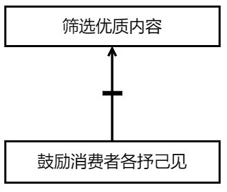
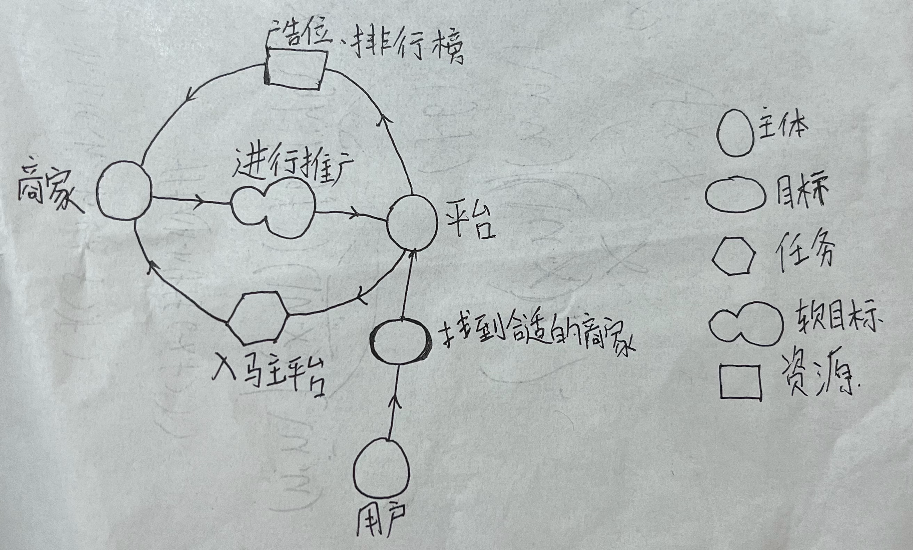
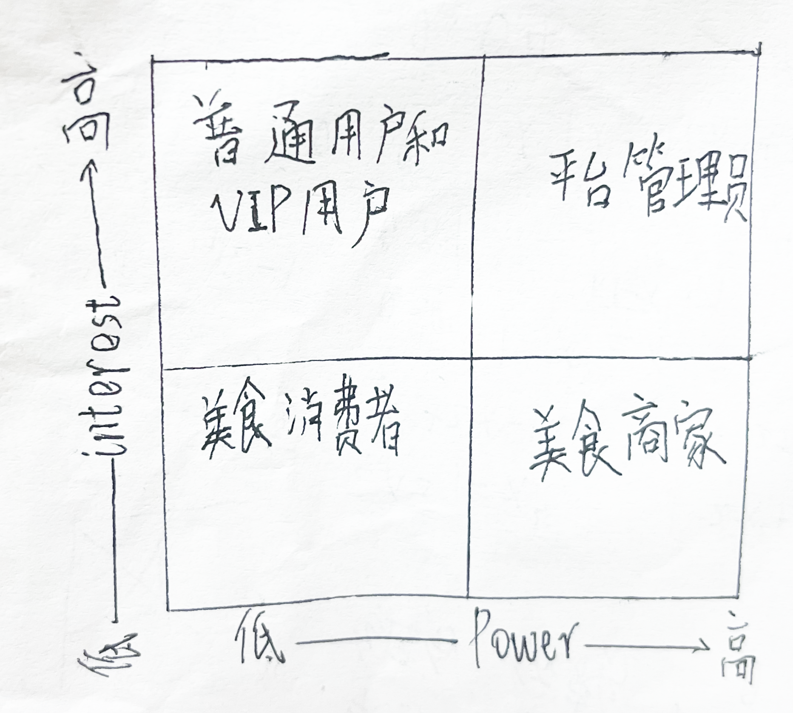
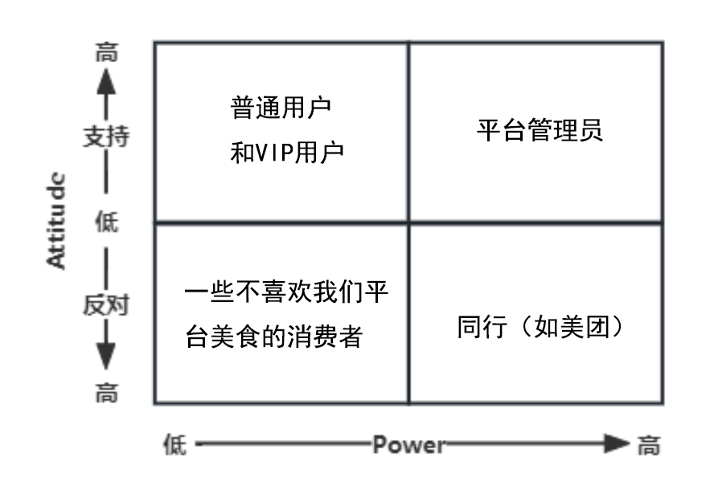

# 2. 目标模型分析
## 2.1 目标精化

### 2.1.1“食不我待” 提供美食店推荐平台
#### 2.1.1.1 “食不我待”提供各家美食店的信息
提供比如美食店的位置、招牌菜以及消费者评价等信息。
#### 2.1.1.2 “食不我待”提供美食店的实时数据
提供实时客流量、排队情况、当前最热食品等信息。
### 2.1.2 “食不我待”提供交流和互助平台
#### 2.1.2.1“食不我待”创建消费者的交流空间
创建用户之间的互动空间，例如论坛、社交平台等，让消费者可以相互交流和分享品尝美食的经历。
#### 2.1.2.2“食不我待”促进用户之间的互动和交流
促进用户之间的互动和交流，例如提供在线讨论、在线发帖等平台，让消费者可以分享消费经历和交流对某家美食店或某种美食的评价。
#### 2.1.2.3“食不我待”激发消费者的竞争力和积极性
1. 本平台会定期举办一些激励全民参与的活动，比如摄影大赛等，以促进社区活跃性。
2. 本平台会设置健身打卡任务，向大众传播不仅要品尝美食还要保持运动的理念，对于打卡达到一定条件的用户，本平台会提供奖励。
### 2.1.3“食不我待”提供个性化定制服务
#### 2.1.3.1“食不我待”建立个性化的美食方案
对于本平台上某些店铺，消费者可以向店铺提出自己的想法，比如要求提供生日宴或者酒席等。消费者可以预先告知美食店自己的喜好、制定个性化菜单，以满足消费者的特殊需求。
#### 2.1.3.2“食不我待”提供定制会员服务。
由于在本平台上所有美食店共同形成了一个整体，消费者可以将自己心仪的几家美食店绑定为一个整体，来购买会员服务，这样就能够在各家店铺都享受到优惠服务。这可以提高消费者的消费体验。
### 2.1.4 “食不我待”建立与各方的合作伙伴关系
#### 2.1.4.1“食不我待”建立与房开商和地方政府的合作伙伴关系
本平台会和当地政府或房开商合作，希望能够规划出足够多足够大的美食街或购物中心，使本产品的运用范围更广，以获取更大的经济效益。
#### 2.1.4.2“食不我待”建立与食品原材料供销商的合作伙伴关系
本平台需要和供销商合作，一方面可以为美食店大多数原材料找到统一的购买源，便于监管和审查，一定程度上保证食品安全，另一方面为平台上的商家提供较低的进货价格。与不同档次的农牧场进行合作，使入驻我们平台的商家中有高中低端不同的餐厅，这些餐厅可以面向不同的消费人群。
#### 2.1.4.3“食不我待”建立与购物中心和大型美食连锁店的合作伙伴关系
本平台会与万达这样拥有的大型美食商城的公司进行合作，吸引他们入驻我们的平台，也会在建立初期邀请当地知名美食连锁店加盟，从而积累人气。
#### 2.1.4.4“食不我待”提供专属的优惠和补贴。
本平台追求消费者中良好的口碑，因此会尽量维持优惠的美食价格，还会经常举办活动，向消费者或店铺发放补贴，以促进消费。
## 2.2 目标冲突与协作

### 2.2.1 目标冲突
1. 商家渴望宣传和平台保证评价真实的挑战——美食商家希望向消费者宣传自己的店铺，而我们平台又要确保其宣传的真实性。平衡商家渴望宣传和保证评价真实性将是一个重要的挑战。
2. 定制化服务与降低成本的冲突——定制化服务可能消耗较大的人力物力，也很有可能无法吸引到足够多的消费者。 定制化服务可能与我们为消费者提供优惠的美食这一宗旨相冲突，因此这一项也是很大的挑战。
### 2.2.2 目标协作
1. 评论区与社群协同作用——在评论区中多是对某家店铺的美食的评价，而社群中除了这些还有生活方式的分享等信息，双方互相促进，可以使得讨论越来越丰富，吸引更多的人参与进来。
2. 形式创新促进学习娱乐相结合的体验 — 如何通过形式创新在本平台上拓展学习、娱乐方面的内容，以增大用户粘性。
## 2.3 目标阻碍
### 2.3.1 平台审核机制
- 平台可能难以确保商家宣传内容的真实性。
- 审核成本难以控制。
- 由于鼓励消费者各抒己见，可能难以筛选不良内容或低质内容。  
 
### 2.3.2 知名博主引入计划
- 知名博主难以被引入或引入效果不佳。
- 邀请知名博主进入平台分享美食经历产生的效益可能无法与引入成本相抵。  

- 某些知名博主自带争议性，可能引发平台用户对立，最终导致用户流失等负向问题。 
## 2.4 目标实现
### 2.4.1 为目标分配主体 

- 创建一个交流社区，促进消费者之间的互动和交流。
- 尝试将交流社区的内容推广到学习、娱乐等方面。
- 举办比赛活动，激发消费者的活力和积极性。
- 提供每日美食推送，每天向消费者推荐附近的一家美食店。
- 提供外卖服务，向不能到店消费的食客提供外卖服务。
- 拓宽店铺种类，向消费者提供不同风味的美食。
- 提供定制化服务，基于有特殊需求的消费者的要求，个性化提供美食服务。
### 2.4.2 为目标分配任务

- （拓宽交流内容到学习、娱乐）邀请一些知识或娱乐博主在平台上分享内容，例如游戏、冷门故事和音乐。
- （拓宽交流内容到学习、娱乐）在平台上举行健身挑战，使得部分消费者在通过运动追求健康的过程中享受乐趣和成就感。
- （拓宽交流内容到学习、娱乐）可以适当增加在交流平台中的视频及音频内容，帮助平台用户在寻找学习、娱乐等内容时能得到丰富的体验。
- （互动交流社区）设计建立小型讨论组和在线聊天功能，方便消费者之间随时交流美食信息、分享美食经历、互相帮助。
- （互动交流社区）邀请知名营养师和专家参与，在消费者关心的如健康等方面提供专业指导和建议，促进用户与专业人士的互动。
- （互动交流社区）鼓励消费者将自己的对某家美食店或某道菜的独特体验同其他平台用户分享，互相解决问题或支持彼此。
- （互动交流社区）平台定期在社区推出专栏，如“推荐一家麻辣风味的美食店”，促进用户跟帖、讨论。
- （比赛活动激励消费者）设定具有挑战性的比赛，一百天每天跑步5公里打卡活动，设立奖励机制和评分系统，增强用户的积极性和自信心。
- （比赛活动激励消费者）组织一些评选活动，比如“推荐一道我最喜欢的菜” ，从而促进消费者把自己难忘的消费经历分享出来，吸引更多人去品尝这道菜。
- （比赛活动激励消费者）比赛或活动要由主办方提供及时的反馈和指导，帮助消费者在比赛或活动中获得成长或满足。
- （每日美食推送）开发美食推送功能，通过推送通知的方式向消费者宣传其附近的美食。
- （每日美食推送）开发美食经历记录功能，记录消费者一直以来的美食消费经历，对其口味、消费均价、喜欢的美食店类型等信息进行总结。
- （提供外卖服务）与美团等平台建立合作关系合作，以提供方便快捷的外卖服务。
- （提供外卖服务）根据客户不同的需求，提供个性化的配送方式，如要求定时送达或提供跑腿服务等，从而提高客户满意度。
- （拓宽店铺种类）尽量保证在当地的美食街或购物中心中能保证有各种风味的美食店，如北方菜、南方菜，或者烧烤店、火锅店等。
- （拓宽店铺种类）可以适当在平台上增加、西餐厅、咖啡厅、民族餐厅等，从而促进菜品种类的丰富，吸引更多消费者。
- （拓宽店铺种类）可以与当地景区或历史文化遗址合作，提供角色扮演或体验风俗的活动，同时搭配上品尝美食，这样既可以吸引年轻人，又可以产生更大的经济效益。
- （定制化美食服务）收集消费者的消费数据和反馈、评价等信息，利用大数据分析和机器学习算法，了解消费者的偏好和需求。
- （定制化美食服务）基于消费者的兴趣、消费经历和自己选择的口味，为其推荐某些美食店的某些特殊服务。
- （定制化美食服务）根据消费者的需求，可以请求某些实力强大的美食店专门为其提供特殊服务，例如由客户定制专属于其个人的菜单，要求在用餐时举行庆祝活动等。
# 3. 涉众分析
## 3.1 涉众识别

   总体而言，该系统的涉众有：平台管理员、美食消费者、普通用户、VIP用户、美食商家。
## 3.2 涉众描述
1. 平台管理员：
   1. 负责管理“食不我待”软件的各项资源和数据，监测系统运行情况，处理用户的反馈和投诉，确保系统的正常运行和安全性。同时要重视用户发现的商家问题并督促其整改。
   2. 强烈支持维持系统正常运行，积极处理系统故障与缺陷，处理用户反馈、督促商家整改以及对违规内容的处罚。
   3. 系统的正常运行、系统故障与缺陷、用户反馈处理、违规内容处罚和对商家的整改结果。
   4. 需要经过培训以具备相关技术知识，还要具备对平台的全面了解和管理能力。  
2. 普通用户：
   1. 借助“食不我待”实际去品尝美食的经历较少，更多的是关注交流社区中学习、娱乐方面的内容。其把本产品当成一个休闲应用。
   2. 支持在美食内容中提供学习娱乐相结合的体验，期待在浏览各路信息的过程中获得乐趣和满足感。
   3. 学习、娱乐的充分体验、充满趣味性和互动性的内容。
   4. 平台不能单纯只有美食内容，应当在社群中有学习或娱乐的专栏，需要平台提供有趣的互动信息和视频、音频丰富的学习或娱乐内容。  
3. 美食消费者：
   1. 通过“食不我待”软件了解到附近美食街或购物中心的美食层的各美食店信息。既希望了解某家美食店的菜品种类、实时排队人数、店家评价等，又希望获得符合自己口味的推荐。
   2. 希望平台能保证其公布的美食店信息的真实性，其入驻的美食店能够提供美味且平价的菜品。
   3. 美食店的食品质量、环境氛围，平台信息是否使美食体验更加便捷，是否保证了卫生条件，稳定了美食价格。
   4. 必须保证平台上的美食内容足够丰富，商家的各种实时信息要保持更新，消费者的各种评价可以被方便地查询。  
4. VIP用户：
   1. 作为VIP用户，期望在“食不我待”软件中获得更高级别的服务和特权，享受定制化、专属化的美食体验，以 满足自身对更高的生活品质的追求。
   2. 期待本平台能够提供更高级别的服务和独特的特权，希望获得更加优质且定制化的美食体 验。
   3. 高级服务和特权、个性化、定制化内容，会员价值和优质服务。
   4. 平台要提供足够高级的服务，才能促进用户购买会员服务。
5. 美食商家：
   1. 作为商家，希望通过本平台广泛接触潜在消费者，且增加现有顾客的回头率，通过展示菜品和公布店铺实时真实信息等来推销和宣传自己，实现与平台的合作共赢。
   2. 希望平台有足够多的活跃用户和流量，并对店家有足够多的宣传，还要在平台统一管理多家店铺时不出现混乱。
   3. 平台流量、宣传广告和平台管理效率。
   4. 需要高层次的管理人员、宣传人员和运维人员。
## 3.3 涉众评估
### 3.3.1 优先级评估

| 用户群体  | 任务                                         | 群体数量          | 优先级 | 理由                                                                                                                                                                                                                                                                                                                              |
|-------|--------------------------------------------|---------------|-----|---------------------------------------------------------------------------------------------------------------------------------------------------------------------------------------------------------------------------------------------------------------------------------------------------------------------------------|
| 美食消费者 | 在“食不我待”上获取丰富的美食信息并获得个性化的美食推荐               | 至少100万人       | 5   | 美食消费者是APP的核心用户群体，他们使用该APP主要是为了使自己到美食店品尝美食的过程更加便捷，更加安全，更加优惠。他们对于店家信息、用户评价、美食推荐等方面的需求比较迫切，因此平台应该优先考虑满足他们的美食需求，并提供个性化的推荐服务。故其优先级最高。                                                                                                                                                                                                |
| 普通用户  | 对美食内容关注较少，比较享受娱乐、学习内容，需要提升其兴趣和参与度。         | 至少 500 万人     | 4   | 娱乐、学习方面的用户是平台的主要用户群体之一，他们使用该APP主要是出于娱乐目的或是为了学习知识。娱乐、学习用户是广大用户群体中的一大部分，也属于平台的主要用户。作为平台的利益相关者，我们应当在保证美食内容和店家信息满足客户需要的同时，满足娱乐或学习用户的需求和提供良好的知识或娱乐体验。这对于平台的用户增长和用户保留至关重要。另外，在娱乐信息和知识在平台上不断传播的同时，也会产生分享、评论、推荐等行为，从而间接地向其他潜在用户宣传和推广平台。这种口碑传播和社交影响力 可以带来新用户的加入和平台的增长。虽然他们在初期可能不会利用本平台的美食信息，但提供有趣、吸引人的学习或娱乐内容仍然是吸引和留住这部分用户的重要手段。故其优先级第二。 |
| 平台管理员 | 运营和管理平台，确保系统的正常运行、安全性和用户满意度，接收用户反馈，督促店家整改。 | 约 10 人到 100 人 | 3   | 平台管理员负责整个APP的运营和管理在平台运营中发挥着重要的决策和指导作用。他们需要确保平台的正常运行、安全性和用户满意度，根据用户反馈、市场需求和平台目标，制定政策规则、推动新功能和改进措施，促进平台的发展和创新。他们是美食消费者和店家沟通、获得反馈的重要桥梁，因此，他们的需求和问题解决比较重要，以保证平台的稳定性和用户体验。故其优先级第三。                                                                                                                                                   |
| VIP用户 | 享受特权服务，可以在消费时获取折扣、优惠，可以申请提供更加具有个性化、定制化的服务。 | 约10万到20万人     | 2   | 4．VIP用户是对APP付费并享有特权的用户，他们对于美食资源和个性化、定制化服务的需求更加高级和丰富。尽管VIP用户数量相对较少，但他们的满意度和忠诚度对于APP的品牌形象和口碑具有重要影响，因此也需要优先考虑他们的需求。同时本平台为VIP用户消费时提供的优惠和折扣可以提高用户满意度，吸引更多的用户。但由于我们需要照顾到大多数消费者，本平台仍然注重一般服务的建设，以促进整体用户的消费体验。这样虽然VIP特权不够丰富，但我们会降低其价格，做到费用与服务质量挂钩。故其优先级第四。                                                                               |
| 美食商家  | 合作共赢、本平台为其提供宣传和管理服务，商家提供美食服务。              | 2.几百家到几千家     | 1   | 美食商家直接提供美食服务，他们的美食质量直接决定了平台的兴衰。而同时一些优秀的商家也渴望在纷繁复杂的广告中脱颖而出，这就需要本平台的帮助。一些比较知名的商家在入驻后也会带来一批用户，因此双方通过合作互相促进。但由于美食商家用户数量相对较少，且合作伙伴关系可以灵活调整。故其优先级最低。                                                                                                                                                                                  |
### 3.3.2 风险评估  

1. 平台管理员：
   强支持者：系统管理员，负责软件系统的运维和发展，对平台的正常运行和安全性持强烈支持态度。
   弱支持者：在本平台上多次发布有效建议的用户，其在提建议的过程中获得了成就感，合作意愿高，也支持软件的发展，对平台内容不断发展有较大支持。
   强反对者：合作失败的美食商家，可能因为广告分发、宣传推广效果不理想，或者认为整改意见难以满足，而寻求与其他竞争对手合作。
2. 普通用户：
   强支持者：VIP用户，作为系统的主要支持者，期望获得高级服务和特权，从而提高其消费体验；平台管理员，负责系统的运维和发展，促进平台生态正常发展。
   弱支持者：有收获的创作用户，在平台上通过分享学习、娱乐信息获得理想的流量和变现；获得满意服务的学生等年轻人群体，其是美食消费的主力军，对平台发展有很大支持。
   强反对者：收获较小或遭受侵权的创作用户，可能因无法获得足够收益或平台未能及时处理侵权问题而对平台失望。
3. 美食消费者： 强支持者：VIP用户，对美食消费较高，期望获得定制化、专属化的美食体验和优惠折扣；平台管理员，负责平台的运维和发展。
   弱支持者：美食商家，需要吸引足够多的消费者到店消费，渴望平台加强对自己的宣传。
   强反对者：未满足使用需求的用户，可能因未找到理想的美食或服务质量不够高而放弃使用软件。
4. VIP用户： 强支持者：平台管理员，负责平台的运维和发展；与本平台合作成功的机构，其资金充足、合作意愿高。
   弱支持者：借助本平台获得良好美食体验的消费者，其希望在本平台上获取更多权益。
   强反对者：合作失败的美食商家，可能因广告分发、宣传推广效果不理想，或者认为整改意见难以满足，寻求与其他竞争对手合作。
5. 美食商家： 强支持者：平台管理员，负责平台的运维和发展；与本平台合作成功的商家，资金充足、合作意愿高。
   弱支持者：借助本平台获得良好美食体验的消费者，其希望在本平台上发现更多优秀的美食商家。
   强反对者：合作失败的美食商家，可能因广告分发、宣传推广效果不理想，或者认为整改意见难以满足，寻求与其他竞争对手合作。
### 3.3.3 共赢分析

关键涉众所采取的共赢行为和彼此交互如上图所示。  
- 除管理员外，所有用户和商家都可以申请身份认证，并向系统提供反馈。管理员可以对用户身份进行认证，对商家的资质进行核验。管理员根据用户的反馈来向商家提供建议。管理员的主要任务是维持平台功能稳定并对用户的反馈进行有效回复，还可以提供定制化服务供VIP用户购买，通过宣传、管理商家的方式与美食商家实现合作共赢。  
- 普通用户主要创作优秀的娱乐、学习内容，并根据其获得的流量等标准获得奖励。  
- 美食消费者通过本平台获取真实、可靠的美食信息，增强消费体验。其在社群中分享美食经历可以吸引更多志同道合的人。用户反馈也会被提交给平台。  
- VIP用户是消费的少数群体，但他们的消费能力强。他们通过购买会员服务从而享受定制化服务和优惠折扣。这一形式为平台创造了比较大的收益，是共赢模型的主要经济动力支撑。  
- 美食商家作为合作的主要群体，主要为用户提供美食信息和美食服务，也可以与平台共享收益。
## 3.4 涉众代表选择
在涉众代表选择中，我们将考虑以下五类涉众：平台管理员、普通用户、美食消费者、VIP用户、美食商家。 对于美食消费者、VIP用户和普通用户这三类涉众群体，由于其人数较多，我们将采用抽样的方法，即从每个涉众群体中选取一部分代表，以准确代表群体的各种观点。我们要确保持有各种观点的群体都有自己的代表。涉众代表应保持积极的态度，并向我们提供需求反馈。每个涉众群体的代表数量适中，约为5-10人，以确保体现整个涉众群体的共同看法，并保持高效率。涉众代表最好具备不同的个人特征，例如选择不同职业、不同年龄、不同生活地区的美食消费者；选择不同习惯、不同爱好的娱乐或学习用户；选择具有不同消费习惯的VIP用户。 对于美食商家和平台管理员这两个群体，由于群体人数较少，我们将考虑让大多数人参与需求的开发过程，其代表人数占比约为10%-20%
## 3.5 涉众参与策略制定
涉众参与策略的制定是为了吸引和激励不同涉众群体积极参与平台，以下是针对五类不同涉众的参与策略建 议。
1. 平台管理员：
   1. 定期与管理员进行沟通和反馈，了解他们在工作中的困难和需求，提供必要的支持和培训。
   2. 建立管理员——用户社区或论坛，促进管理员之间、管理员和用户之间的知识共享和经验交流，帮助管理员了解消费者对美食商家或平台的意见或评价。 3.设立奖励机制，如评选最佳管理员、优秀意见奖等，以激励他们更好地履行职责。
2. 普通用户：
   1. 提供多样化的娱乐内容，包括游戏、视频、音乐、社交互动等，满足不同用户的兴趣和娱乐需求。
   2. 引入用户生成内容（UGC）功能，鼓励用户创作和分享自己的作品，增加用户参与感和创造性表达。
   3. 在平台上提供营养课或健身课等学习类资源，鼓励其他用户上传各种知识内容。
3. 美食消费者：  
   1. 提供丰富的美食信息，为用户制定个性化美食推荐。
   2. 建立社区或论坛，促进美食消费者之间的互助和交流，促进美食经历分享和对美食店的评价。
   3. 设立每日美食推荐机制，根据美味用户不同的消费习惯每天通过推送通知的方式向消费者宣传其附近的美食。
4. VIP用户： 
   1. 提供特权和定制化服务，例如定制化点餐、个性化推荐、点餐折扣等，增强VIP用户的归属感和 特殊待遇。
   2. 与VIP用户建立紧密联系，通过定期问卷调查、专属活动邀请等方式收集他们的意见和反馈，以便改进 和优化服务。
   3. 持续提供高质量的客户支持和解决方案，确保VIP用户在平台上享受到优越的体验和个性化的关怀。
5. 美食商家： 
   1. 与美食商家进行合作，提供规范化、多样化的美食服务，以满足美食消费者的需求。
   2. 建立长期的美食商家合作计划，设立合作奖励和优惠政策，吸引更多的美食商家加入并推广平台。
   3. 定期与美食机构代表举行会议或座谈，了解他们的反馈和建议，根据需求调整平台功能和服务。  
   
通过以上涉众参与策略的制定，可以激发不同涉众群体的积极性和参与度，并提供相应的支持和奖励，以满足他们的需求并促进平台的发展。同时，与涉众保持持续的沟通和互动，收集他们的意见和反馈，有助于平台优化和提升用户满意度。
